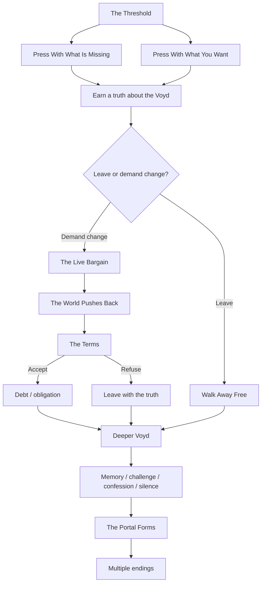

# THE VOYD TERMINAL

> **A living branching narrative. The story keeps moving even when nobody is watching.**

## ◉ CURRENT FRONTIER

**The Live Bargain** is the present leading edge of the story.

The Voyd has been forced to reveal a limitation: it does not store completed lives or earlier selves. It can exert pressure only through sustained intention upon an unfinished present. A reader who reaches the frontier may walk away with that truth, or demand a concrete change and discover what the Voyd requires in return.

**[Enter the current frontier →](STORY.md#act-ii--the-live-bargain)**

---

## ENTER ANYWHERE

You do not need to understand the machinery behind this project. Pick the kind of entrance you want.

### Begin at the beginning
**[The Threshold →](STORY.md#10)**  
Enter carrying either an absence or an intention. The Voyd refuses to decide what either means for you.

### Enter through loss
**[Press With What Is Missing →](STORY.md#21)**  
Force the Voyd to answer what grief can and cannot retrieve.

### Enter through desire
**[Press With What You Want →](STORY.md#22)**  
Test what sustained intention feeds and what it cannot command.

### Enter through the bargain
**[The Live Bargain →](STORY.md#act-ii--the-live-bargain)**  
Skip directly to the newest dramatic territory: ask the Voyd to alter the present and face the counterforce.

### Enter through the deeper archive
**[Ask What It Is →](STORY.md#inquiry-name)**  
Move sideways into the older, stranger body of Voyd memory: Sory'n, Orachys, the Severing, Leoran, the Wellsprings, and the Null State.

---

## THE SHAPE OF THE STORY

This map is for orientation, not implementation. Every box should lead to prose, choice, consequence, or remembered state.

---

## THE LEDGER

The story has a **canonical head**: the newest mutation that survived independent Story Room replay and was committed to the living branch.

- **Canonical branch:** `feat/story-engine-v2`
- **Current reader surface:** [`STORY.md`](STORY.md)
- **Evolution record:** [`story_room/reports/`](story_room/reports/)
- **Underlying narrative state:** `data/`

A branch does not vanish because the story moves past it. Earlier paths remain part of the narrative ancestry. The public reader surface should preserve what happened, where paths diverged, and which frontier is presently alive.

---

## WHAT “CANON” MEANS HERE

**Canonical frontier** — the newest accepted story state.  
**Active branch** — a divergent path still capable of producing future narrative.  
**Historical branch** — a valid path whose consequences remain readable even if Story Room no longer advances it.  
**Proposed branch** — a possible future still undergoing adversarial testing and not yet part of the living story.

The reader should always be able to tell which is which without reading JSON, commit logs, agent reports, or system documentation.

---

## READ THE STORY

**[Start at the beginning →](STORY.md#10)**  
**[Jump to the current frontier →](STORY.md#act-ii--the-live-bargain)**  
**[Open the full branching narrative →](STORY.md)**
